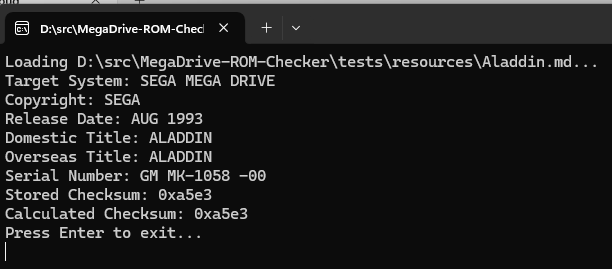

# MegaDrive ROM Checker

This is a simple program written in C++ that checks the integrity of MegaDrive ROM files.
It verifies the ROM's checksum, header, and other properties to ensure that the file is a valid MegaDrive ROM.
Technically it can support any ROM file, but the implementation is focused on MegaDrive ROMs.

# Usage

To use the MegaDrive ROM Checker, simply drag the ROM file onto the executable (Windows)
or run the executable with the ROM file as an argument (Linux/Mac).

# Requirements
- `CMAKE` v3.0 or newer
- `C++` compiler (e.g., `g++`, `clang++`, `MSVC`)
- `C++20` standard support

# Development
